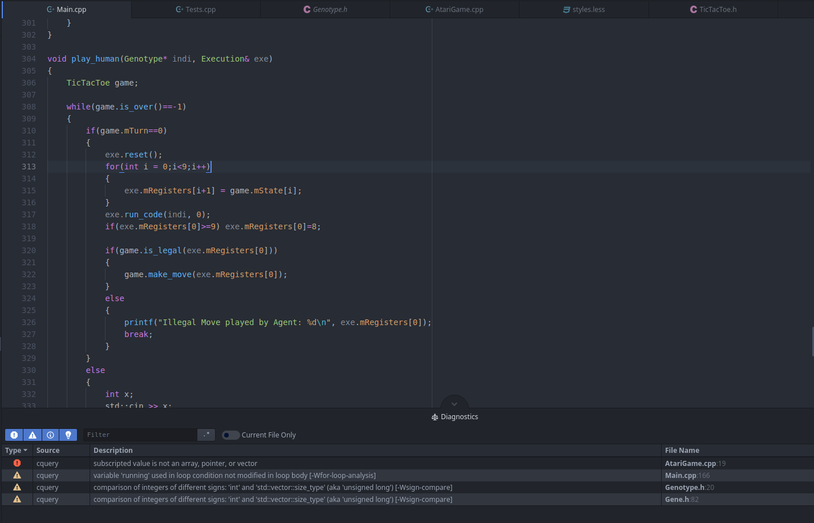

# ide-cquery

[](https://atom.io/packages/ide-cquery)
[](https://atom.io/packages/ide-cquery)



Provides C and C++ language support for [Atom][atom] using
[Cquery language server][cquery]

## About

This is an Atom package that connects the [atom-ide-ui][atom-ide-ui] package to [cquery][cquery]. cquery is a highly-scalable, low-latency language server for C/C++/Objective-C.

This plugin provides ide-like features for C/C++ and Objective C, including Code Completion, Diagnostics, Find References etc.

All contributions and feedback are appreciated.

## Features
Code Completion

Diagnostics

Find References

Code Highlight

Definitions

Hyperclick

Datatips

Semantic Highlighting

Fade out Inactive Regions

Signature Helper

Outline

## Project Setup

To specify include directories and other clang options, a `compile_commands.json` file on your project root directory will suffice.

If you can't create a `compile_commands.json` file, you can alternatively add a file named `.cquery` to your project root directory.

Each argument in that file is separated by a newline. Lines starting with `#` are skipped. The first line can optionally be the path to the intended compiler, which can help if the standard library paths are relative to the binary. Here's an example:

```
# Driver
/usr/bin/clang++-4.0

# Language
-xc++
-std=c++11

# Includes
-I/work/cquery/third_party
```
## Semantic Highlighting

Semantic Highlighting allows context based coloring of text. For example, member variables can be colored differently than local variables, and other such highlighting that is not provided by the default C++ grammars provided in Atom.

The default semantic hightlighting theme is suited for the One Dark UI. You can change the theme by adding this to your styles.less file:

```
atom-text-editor {
  .cquery--disabled {
    color: hsl(220, 10%, 40%)
  }
  .cquery--type {
    color: hsl(355, 65%, 65%)
  }
  .cquery--typeAlias {
    color: hsl(355, 65%, 65%)
  }
  .cquery--enum {
    color: hsl(355, 65%, 65%)
  }
  .cquery--enumConstant {
    color: hsl(286, 60%, 67%)
  }
  .cquery--templateParameter {
    color: hsl(286, 60%, 67%)
  }
  .cquery--freeStandingFunction {
    color: hsl(220, 14%, 71%)
  }
  .cquery--memberFunction {
    color: hsl(207, 82%, 66%)
  }
  .cquery--staticMemberFunction {
    color: hsl(207, 82%, 66%)
  }
  .cquery--freeStandingVariable {
    color: hsl(220, 14%, 71%)
  }
  .cquery--globalVariable {
    color:  hsl(220, 14%, 71%)
  }
  .cquery--memberVariable {
    color:  hsl( 29, 54%, 61%)
  }
  .cquery--staticMemberVariable {
    color: hsl(355, 65%, 65%)
  }
  .cquery--parameter {
    color: hsl(220,  9%, 55%)
  }
  .cquery--namespace {
    color: hsl( 95, 38%, 62%)
  }
  .cquery--macro {
    color: hsl(286, 60%, 67%)
  }
}
```

Simply change the color attribute of the scope you want. For example, if you want global variables to be colored Red, change

```
.cquery--globalVariable {
    color:  hsl(220, 14%, 71%)
  }
```
to
```
.cquery--globalVariable {
    color: #FF0000
  }
```

## Requirements

+ [Atom 1.21-beta][atom]
+ [atom-ide-ui][atom-ide-ui] atom plugin
+ [clang][clang]
+ [cquery Language Server][cquery_wiki]

[atom]: http://atom.io/beta
[cquery]: https://github.com/cquery-project/cquery
[cquery_wiki]: https://github.com/cquery-project/cquery
[atom-ide-ui]: https://atom.io/packages/atom-ide-ui
[clang]: http://releases.llvm.org/download.html
